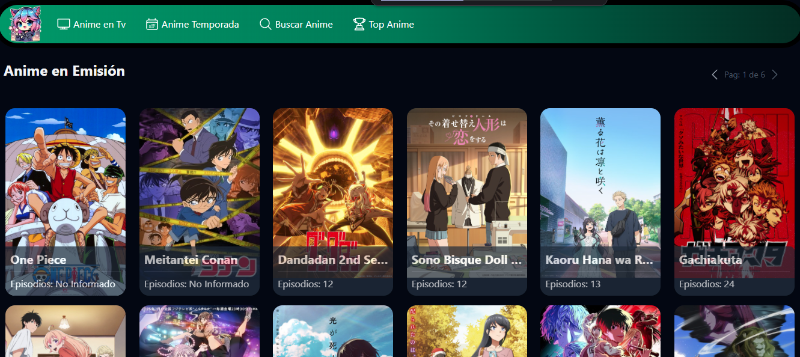

    
    Anime Web

Pagina de consulta de animes, en emision, temporadas y catalogo general

➡️ [Ir a demo](https://damiancosmelli.github.io/anime_web/) 

## 🛠️ Tecnologias:

- ⚛️ [React-Vite v19](https://es.react.dev/)
- 💨 [Taillwind v4.0](https://tailwindcss.com/)
- 🧩 [gh-pages v6.3.0](https://www.npmjs.com/package/gh-pages)

## ⚙️ Servicios Utilizados
- 🌐 API Anime: [Jikan](https://jikan.moe/)
- 🎥 Videos: [YouTube](https://www.youtube.com/)

## 💻 Metodo de publicacion 
Ejecutar la sintaxis para realizar la publicaicon en GitHub Pages: 
        
        npm run deploy

